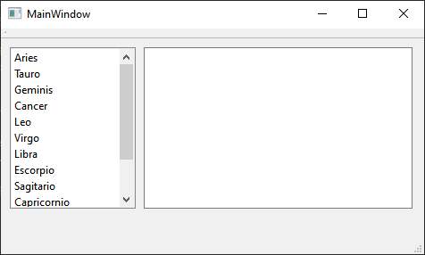
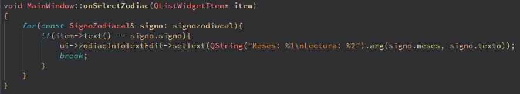
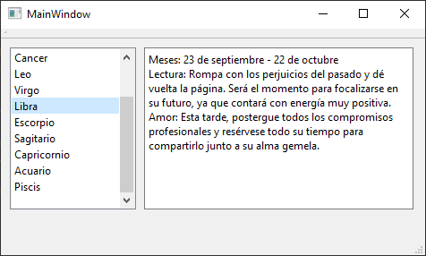

# Ejemplo de uso - Signals y Slots en c++ y Qt Creator

Asignatura: Laboratorio de Tecnología de Objetos

Integrantes:
 - Blanco Trujillo, Antony Jacob
 - Yare Chulunquia, Kevin Pedro

## Código Fuente
El código realizado se encuentra en el directorio [./src/](./src) del repositorio

## Descarga
El programa compilado como un binario se puede descargar mediante el siguiente enlace referente al presente repositorio:
 - :file_folder: Windows x64: [./binaries/SignoZodiacal.zip](https://raw.githubusercontent.com/AntonyBlanco/Laboratorio04TO/main/binaries/ExampleSignalSlotProy.zip)

El ejecutable no puede ejecutarse por si solo, requiere dependencias de archivos tipo .dll pertenecientes a Qt (wn Windows), es por ello que guiados por la [página oficial de Qt](https://doc.qt.io/qt-5/windows-deployment.html#the-windows-deployment-tool) se realizó una búsqueda automática de dependencias con el programa windeploy.exe y posteriormente se comprimió el ejecutable junto con las dependencias en formato ZIP.

## Explicación

Se hace uso de un slot en la clase MainWindow.h que recibirá el evento de botón presionado cuando se quiere seleccionar un signo, esto permite la comunicación entre la lista de botones y el cuadro de texto que mostrará las predicciones.

La conexión se realiza desde la clase mainwindow.cpp con la función connect() que recibe los objetos, la señal a enviar y el slot que va a recibir.

## Ejecución

Al ejecutar el proyecto tenemos la siguiente interfaz:
 - Signos Zodiacales: Es una ventana que muestra una lista de botones para cada signo zodiacal a la izquierda, y un cuadro de texto para mostrar las predicciones a la deracha.
 
>El evento de presionar un botón realiza una iteración sobre la lista de las predicciones y selecciona aquella que corresponde con el botón presionado, de esta manera podemos utilizar el mismo manejador del evento para cada uno de los botones.

Luego, al presionnar uno de los botones (en este caso del signo Libra), se enviará el contenido de la predicción hacia el cuadro de texto.

